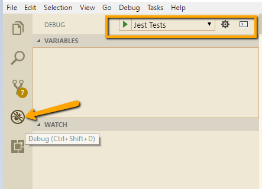

# Debug Jest Test in Visaul Studio  

**This file will describe how to debug jest tests in visual studio code editor.**

We should have launch.json file in root directory  named *.vscode*.

*launch.json* have different configration sections we need add below configration for jest test

## Add new section in launch.json

```bash
"configurations": [
        {
            "type": "node",
            "request": "launch",
            "name": "Jest Tests",
            "sourceMaps": true,
            "program": "${workspaceRoot}\\packages\\red-runtime\\node_modules\\jest\\bin\\jest.js",
            "args": [
                "-i"
            ],            
            "internalConsoleOptions": "openOnSessionStart",
            "outFiles": [
                "${workspaceRoot}/dist/**/*"
            ]            
        },

...
```


## Available Launch configuration attributes

### Configure the following attributes are supported in launch configurations of type launch and attach:

* **protocol** - debug protocol to use. See section 'Supported Node-like Runtimes' above.
* **port** - debug port to use. See sections 'Attaching to Node.js' and 'Remote Debugging Node.js'.
* **address** - TCP/IP address of the debug port. See sections 'Attaching to Node.js' and 'Remote Debugging Node.js'.
* **restart** - restart session on termination. See section 'Restarting debug sessions automatically'.
* **timeout** - when restarting a session, give up after this number of milliseconds. See section 'Attaching to Node.js'.
* **stopOnEntry** - break immediately when the program launches.
* **localRoot** - VS Code's root directory. See sections 'Remote Debugging Node.js' below.
* **remoteRoot** - Node's root directory. See sections 'Remote Debugging Node.js' below.
* **sourceMaps** - enable source maps by setting this to true. See section 'Source Maps'.
* **outFiles** - array of glob patterns to look for in JavaScript files. See section 'Source Maps'.
* **smartStep**- try to automatically step over code that doesn't map to source files. See section 'Smart Stepping'.
* **skipFiles** - automatically skip files covered by these glob patterns. See section 'Skipping Uninteresting Code'.
* **trace** - enable diagnostic output. Set to "all" for verbose output.

### Next Step

Once we have done configuration file click on debug menu on left siderbar as below image and we have our test in dropdown as display below image **Jest Test** for ready to run 



Run the test and we got below message fro started debuggng

```bash
Debugging with inspector protocol because Node.js v8.9.4 was detected.
node --inspect-brk=13092 packages\red-runtime\node_modules\jest\bin\jest.js -i
Debugger listening on ws://127.0.0.1:13092/2b97cc9c-ba9d-4198-85bf-0acae128dec1
...
```